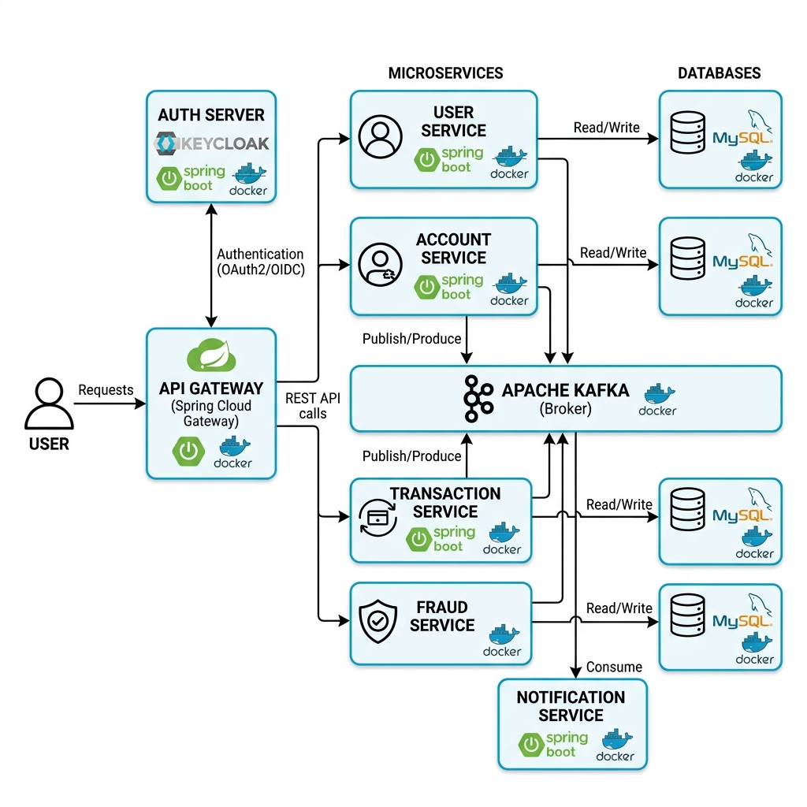

##  Diagramme d'Architecture & Workflow Complet

---

##  Description du Flux Global

Le système est composé de plusieurs microservices interconnectés pour assurer la gestion complète des opérations bancaires :

1.  **Client** : L'utilisateur final interagit avec le système via une application cliente.
2.  **API Gateway** : Point d'entrée unique qui sécurise et route toutes les requêtes vers les services appropriés en se basant sur le token fourni par **Keycloak**.
3.  **Microservices Métier** :
    *   **User Service** : Gère les profils et données des utilisateurs.
    *   **Account Service** : S'occupe de la gestion des comptes bancaires et des soldes.
    *   **Transaction Service** : Gère les virements et l'historique des transactions.
    *   **Fraud Service** : Analyse les transactions en temps réel pour détecter les anomalies ou fraudes.
4.  **Messaging (Apache Kafka)** : Communication asynchrone entre les services (Ex: lorsqu'une transaction est initiée, un événement est produit dans Kafka).
5.  **Notification Service** : Écoute les événements Kafka pour envoyer des alertes et notifications aux utilisateurs.
6.  **Bases de données** : Chaque microservice possède sa propre base de données indépendante (MySQL) pour garantir le couplage faible.

---

## Stack Technique

| Catégorie | Technologies |
|---|---|
| **Language** | Java 17 |
| **Framework** | Spring Boot 3, Spring Cloud, Spring Security |
| **Messaging** | Apache Kafka (KRaft — sans Zookeeper) |
| **Authentification** | Keycloak (OAuth2 / OIDC / JWT) |
| **Service Mesh** | Eureka Discovery, Spring Cloud Gateway |
| **Configuration** | Spring Cloud Config Server (Git repo) |
| **Base de données** | MySQL|
| **Observabilité** | Zipkin, Spring Actuator |
| **Conteneurisation** | Docker, Docker Compose |

---

